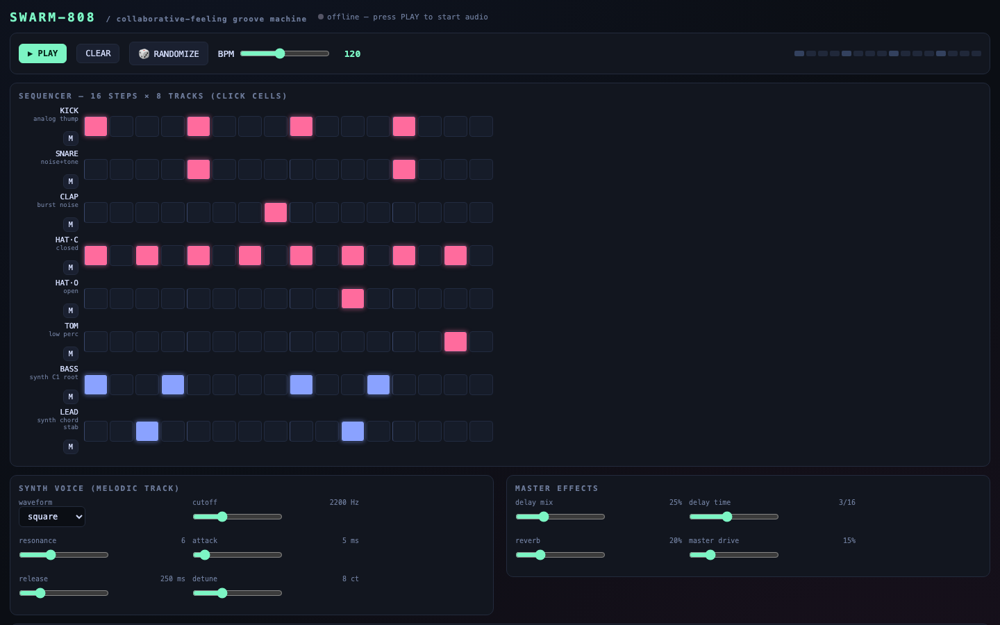

# OX Synth

A real-time synth and drum machine in pure Web Audio: step sequencer, multiple voices, effects, pattern save/load, keyboard playable.

Features: 16-step sequencer | multiple synth voices | effects chain | localStorage patterns | keyboard playable

## Run it

Open `index.html` in any browser (or `python3 main.py` for terminal projects) — no dependencies beyond what's noted in the source.

Source: [github.com/JacobEGarcia/ox-synth](https://github.com/JacobEGarcia/ox-synth)
